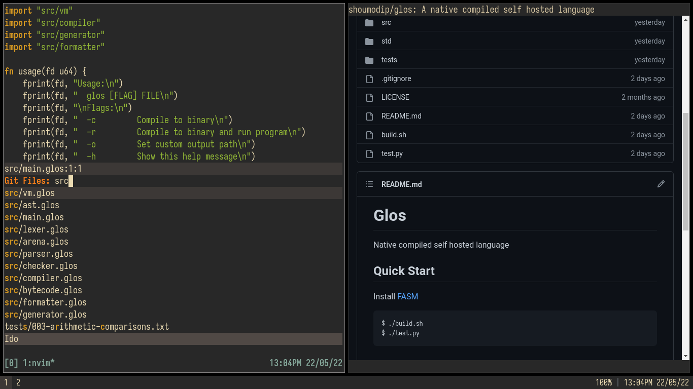

# Setup


## Quick Start
[Install Void Linux](https://docs.voidlinux.org/installation/live-images/guide.html)

```console
$ mkdir -p ~/code
$ cd ~/code
$ git clone https://github.com/shoumodip/setup
$ cd setup
$ ./build.sh
```

## Disclaimer
If you use these dotfiles, any problems you encounter are your resposibility.
